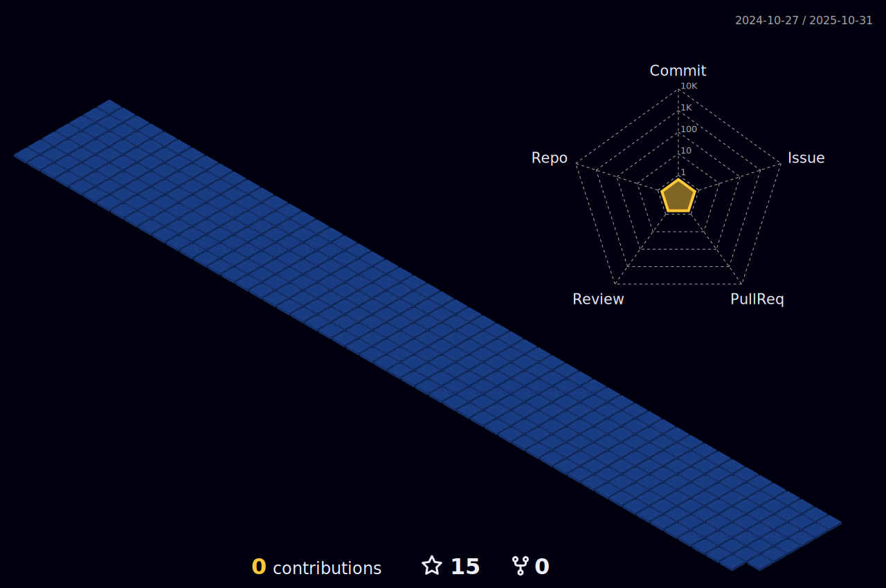

<!-- picture eeeeeeeeeeeeeeE4eeeeeeseeeee -->

 

<!-- Name & others -->

<!-- About -->

I am a self-driven ambitious, and enthusiastic front‑end developer. I have worked on several web development projects using HTML5, CSS3, JavaScript, React JS and Node JS. I am very interested to work as a web developer and I love to do it. The possibilities offered by the industry are endless and this motivates me to keep learning new methods and technologies every day. I would love to contribute to supporting the team’s objectives and outstanding performance.

<!-- Issuess -->

  
 
- 📫 How to reach me: nazrul2517@gmail.com
   
- ⚡ Fun fact: The first computer bug was actually a bug(Moth).
 

  <!-- Skills -->

 </h3>
 

  <a href="https://skillicons.dev" rel="nofollow">
      
    
    
    
  
    
    
    
    
    
  </a>

  <a href="https://skillicons.dev" rel="nofollow">
      
      
      
      
      
      
      
      
      
      
      
  </a>

<!--

<table><tr><td valign="top" width="33%">
### Frontend

  
  
  
  
  
  
  
  
  

</td><td valign="top" width="33%">

### Backend

  
  

  

   
  
  

</td><td valign="top" width="33%">

### Others

  
  
  
  
  

</td></tr></table>  

 -->
 
  <!-- Socials -->

 
 
  
  <!-- 🌐### ✍️  bleh bleh bleh -->

<h3></h3>
 
      

<!-- 🌐### ✍️  Git Statistics-->

  
<b><g-emoji class="g-emoji" alias="gear" fallback-src="https://github.githubassets.com/images/icons/emoji/unicode/2699.png">🔽</g-emoji> &nbsp; More Stats</b>
 
  
  

 <!-- Most Used Language
 <h3>

 </h3>

  
-->

<!-- GitHub Stats -->

<!-- Streak_Stat 

 <h3>

 </h3>

 

-->
<h3>

 </h3>
    
   

 <h3>

 </h3>

<!-- 3D Chart -->

<!-- Snake :3 -->

<!-- Random Dev Quotes -->

  
 

 

 
 
